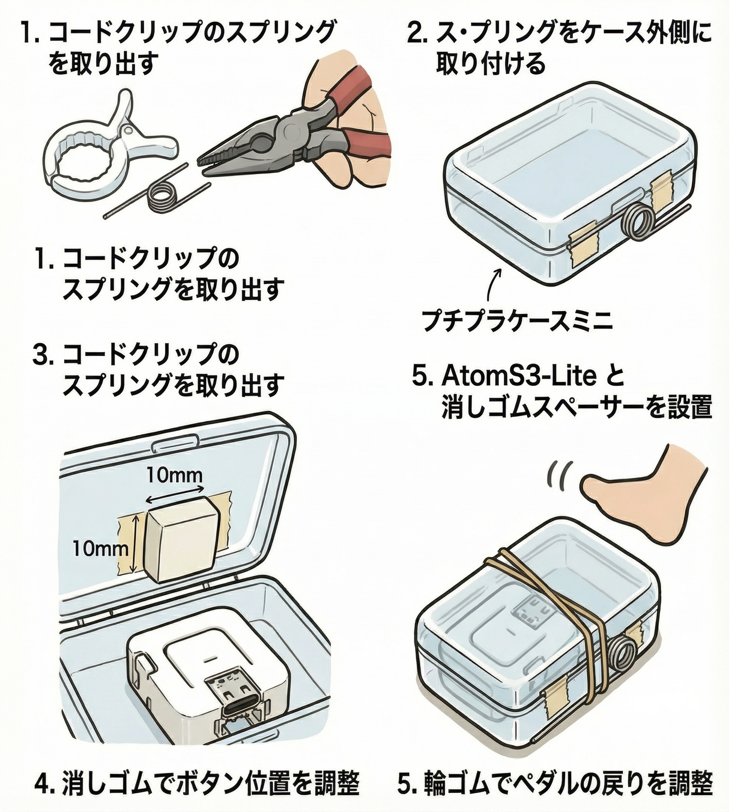

# Budget-G Pedal
100均素材 と AtomS3-Lite で錬成された、財布に優しすぎるゲーミングデバイス『Budget-G Pedal』   

## 概要
Budget-G Pedalは、100円ショップで手に入る素材 と AtomS3-Lite を活用して作成された、低コストで高機能なゲーミングペダルです  
ゲームプレイ中の特定のアクションを足元で簡単に操作できるように設計されています

## 特徴
- **低コスト**: 100円ショップの素材を使用することで、非常に低価格で製作可能。
- **簡単設計**: シンプルな構造で、誰でも簡単に組み立てられます。
- **多用途**: ゲーム内の様々なアクションに対応可能。
- **カスタマイズ可能**: 自分のプレイスタイルに合わせて調整可能。

## 必要な素材
- 100円ショップで購入できるペダル用の素材  
プチプラケースミニ  
コードクリップ (スプリング)  
消しゴム  (スペーサー)  
両面テープ 
輪ゴム
- [AtomS3-Lite](https://www.switch-science.com/products/8778) 

## 組み立て手順

1. コードクリップのスプリング部分を取り出す
2. スプリングをプチプラケースミニの外側に取り付ける
3. プチプラケースミニの中に AtomS3-Lite を設置し、スペーサーとして消しゴムを使用する
4. 10mm x 10mm の消しゴム を 両面テープ で貼り付け、AtomS3-Lite のボタンが押されるように調整する
5. 輪ゴムを使用して、ペダルの戻りを調整する  

## ファームウェアコード
Budget-G Pedalのファームウェアコード は以下のフォルダにあります
- `firmware/AtomS3-Lite/`
このフォルダ内のコードをAtomS3-Liteに書き込むことで、ペダルとして機能します。

